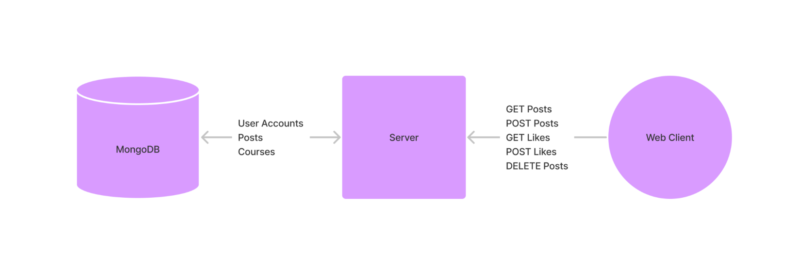

# Project Description:

Our target audience is professors, students and UW Administrators. Our audience will use our application to provide feedback on classes at the University and voice their opinions and point out areas of improvement. The audience can also view feedback collected from students. By doing this, the professors and administrators will know what areas to improve on (if any). We as developers want to build this application to provide our users with a centralized platform/forum to discuss school-related matters. Existing platforms like reddit do not provide a centralized platform.

# Technical Description:




<table>
  <tr>
   <td>Priority
   </td>
   <td>User
   </td>
   <td>Description
   </td>
   <td>Technical Implementation
   </td>
  </tr>
  <tr>
   <td>P0
   </td>
   <td>As a student
   </td>
   <td>I would like to post about my experiences without having my name attached
   </td>
   <td>POSTing new posts to website
   </td>
  </tr>
  <tr>
   <td>P0
   </td>
   <td>As a student
   </td>
   <td>View posts
   </td>
   <td>GETting posts
   </td>
  </tr>
  <tr>
   <td>P0
   </td>
   <td>As a student, professor, admin
   </td>
   <td>Sign up/ Log in
   </td>
   <td>POSTing user data (UW netid, password, role)
   </td>
  </tr>
  <tr>
   <td>P1
   </td>
   <td>As a student
   </td>
   <td>Liking posts
   </td>
   <td>POSTing likes
   </td>
  </tr>
  <tr>
   <td>P1
   </td>
   <td>As a professor
   </td>
   <td>I can view the posts of students in classes so I can improve the course.
   </td>
   <td>GETting posts from website
   </td>
  </tr>
  <tr>
   <td>P2
   </td>
   <td>As an UW administrator
   </td>
   <td>I want to see sentiment data for a certain course
   </td>
   <td>GET sentiment analysis for a certain course
   </td>
  </tr>
  <tr>
   <td>P3
   </td>
   <td>As an Site admin
   </td>
   <td>Remove posts
   </td>
   <td>DELETE posts
   </td>
  </tr>
  <tr>
   <td>P3 
   </td>
   <td>As a site admin
   </td>
   <td>Ban users
   </td>
   <td>POST to account blacklist
   </td>
  </tr>
  <tr>
   <td>P3
   </td>
   <td>As a site admin
   </td>
   <td>Increase account permissions
   </td>
   <td>POST to admin list
   </td>
  </tr>
</table>

# List of available endpoints:


<table>
  <tr>
   <td>Method
   </td>
   <td>Description
   </td>
   <td>Endpoint
   </td>
  </tr>
  <tr>
   <td><code>GET</code>
   </td>
   <td><code>Retrieve all posts</code>
   </td>
   <td><code>/all</code>
   </td>
  </tr>
  <tr>
   <td><code>GET</code>
   </td>
   <td><code>Retrieve a post</code>
   </td>
   <td><code>/p/{id}</code>
   </td>
  </tr>
  <tr>
   <td><code>POST</code>
   </td>
   <td><code>Write a post</code>
   </td>
   <td><code>/p/new</code>
   </td>
  </tr>
  <tr>
   <td><code>DELETE</code>
   </td>
   <td><code>Delete a post</code>
   </td>
   <td><code>/p/delete?id={id}</code>
   </td>
  </tr>
  <tr>
   <td><code>POST</code>
   </td>
   <td><code>Like/Unlike a post</code>
   </td>
   <td><code>/p/{id}?like={boolean}</code>
   </td>
  </tr>
  <tr>
   <td><code>GET</code>
   </td>
   <td><code>Get a course</code>
   </td>
   <td><code>/c/{id}</code>
   </td>
  </tr>
  <tr>
   <td><code>POST</code>
   </td>
   <td><code>Create a course</code>
   </td>
   <td><code>/c/new</code>
   </td>
  </tr>
  <tr>
   <td><code>DELETE</code>
   </td>
   <td><code>Delete a course</code>
   </td>
   <td><code>/c/{id}</code>
   </td>
  </tr>
  <tr>
   <td><code>POST</code>
   </td>
   <td><code>Create user</code>
   </td>
   <td><code>/a/new</code>
   </td>
  </tr>
  <tr>
   <td><code>POST</code>
   </td>
   <td><code>Update user</code>
   </td>
   <td><code>/a/{accountID}?action={action}</code>
   </td>
  </tr>
  <tr>
   <td><code>GET</code>
   </td>
   <td><code>Get user information</code>
   </td>
   <td><code>/a/{accountID}/</code>
   </td>
  </tr>
</table>


# Database Schemas:


```
POSTS {
	Posts: Array<post>
}

POST {
	Id: String
	courseId: String
	Likes: Int
}

COURSE {
	Id: String
Posts: Array<String> // ids of posts belonging to course?
}